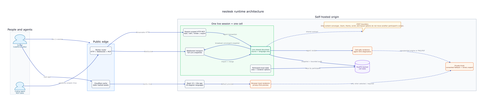
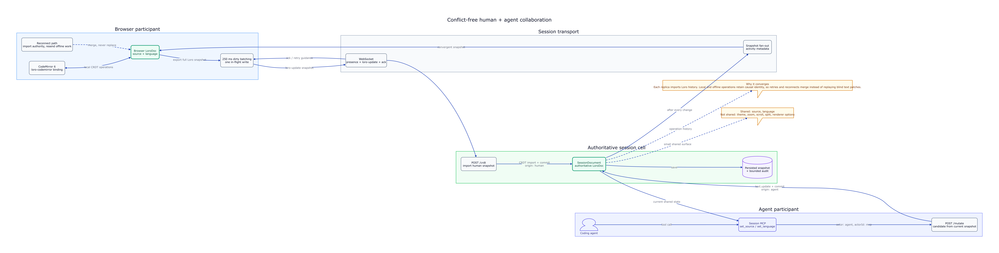
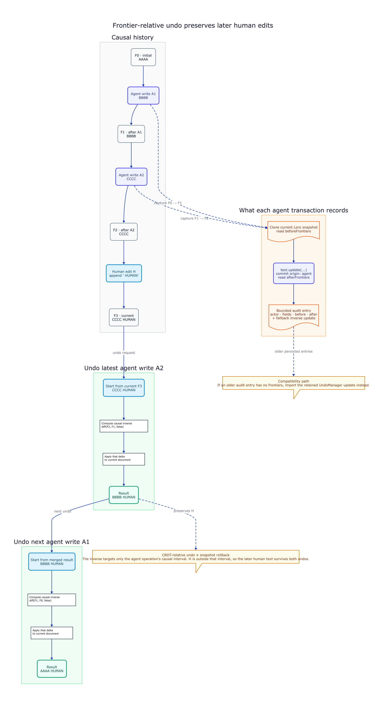
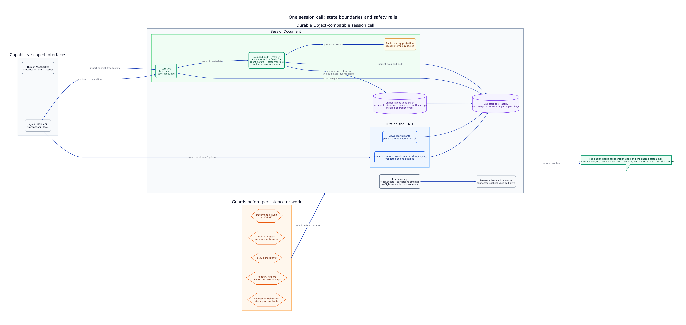

# Architecture diagrams

These views document neolesk's runtime and its conflict-free collaboration model. They intentionally omit CI/CD and deployment pipelines.

## Runtime overview

How humans and agents reach the editor, session cell, renderers, and durable state. The shared Loro document is the center of the live-session path.

Source: [`01-runtime-overview.d2`](01-runtime-overview.d2)

## Conflict-free collaboration flow

How CodeMirror edits, offline browser work, agent MCP transactions, authoritative imports, acknowledgements, and snapshot fan-out converge.

Source: [`02-crdt-collaboration-flow.d2`](02-crdt-collaboration-flow.d2)

## Frontier-relative agent undo

Why undoing an agent edit does not roll back a later human edit. The cell computes an inverse between the agent transaction's causal frontiers and applies that delta to the current document.

Source: [`03-frontier-delta-undo.d2`](03-frontier-delta-undo.d2)

## Session state and safety boundaries

What belongs in the shared CRDT, what remains participant-local, what is ephemeral, what is persisted, and which resource limits guard the cell.

Source: [`04-session-state-and-safety.d2`](04-session-state-and-safety.d2)

## Nomnoml editions

The same four architecture views are also available as UML-oriented Nomnoml diagrams with full PNG renders: [open the Nomnoml set](nomnoml/README.md).
