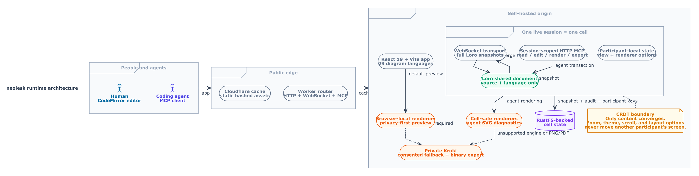
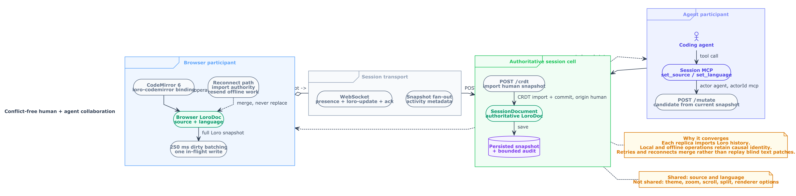
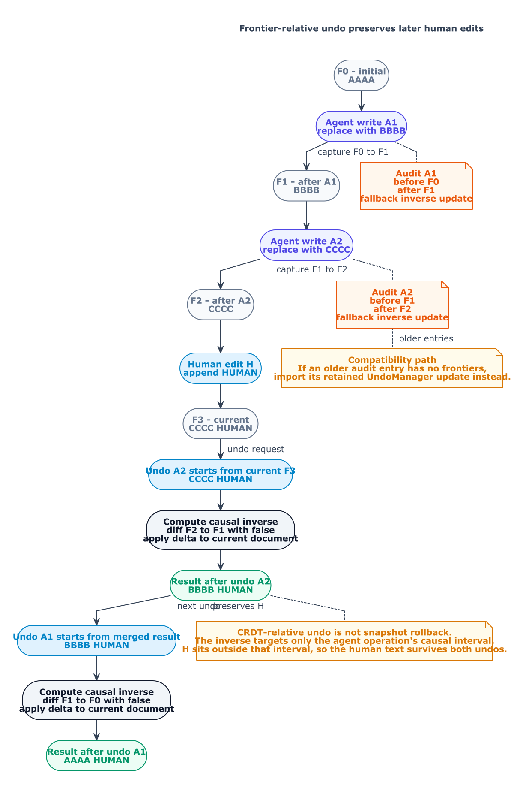
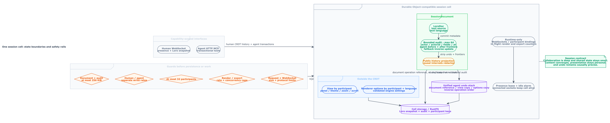

# Nomnoml architecture diagrams

Nomnoml editions of the four neolesk architecture views. They preserve the same concepts as the D2 set while using Nomnoml's UML-oriented frames, actors, notes, databases, and associations.

## Runtime overview

Source: [`01-runtime-overview.nomnoml`](01-runtime-overview.nomnoml)

## Conflict-free collaboration flow

Source: [`02-crdt-collaboration-flow.nomnoml`](02-crdt-collaboration-flow.nomnoml)

## Frontier-relative agent undo

Source: [`03-frontier-delta-undo.nomnoml`](03-frontier-delta-undo.nomnoml)

## Session state and safety boundaries

Source: [`04-session-state-and-safety.nomnoml`](04-session-state-and-safety.nomnoml)

